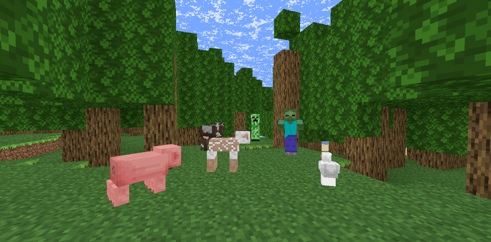

# 网页版 我的世界 · minecraft-web

一个跑在浏览器里的 Minecraft 风格体素游戏。**原生 ES 模块、零构建、不用 npm install** —— 起个静态服务器就能玩。



## 快速开始

```bash
cd minecraft-web
node serve.mjs
```

然后浏览器打开 <http://127.0.0.1:8321>。

> 必须走这个本地服务器。项目用的是浏览器原生 ES 模块，直接双击 `index.html`（`file://`）会被浏览器的模块跨域策略挡住，贴图也读不出来。

没有 `package.json`、没有打包器、没有依赖安装。Three.js 已经放在 `js/vendor/three.module.js` 里，贴图在 `textures/`。

## 操作

| 按键 | 作用 |
|---|---|
| `W` `A` `S` `D` | 前后左右移动 |
| 鼠标 | 转动视角 |
| 空格 | 跳跃（在水里则上浮） |
| `Shift` | 潜行 |
| 双击 `W` | 疾跑（松开 `W` 停下） |
| 左键长按 | 挖掘方块 / 攻击生物 |
| 右键 | 放置方块 / 使用手上的东西（开工作台、熔炉、吃东西） |
| 右键长按 | 连续放置方块 |
| `E` | 打开背包（含 2×2 合成） |
| `1` ~ `9` / 滚轮 | 切换快捷栏 |
| `Q` | 丢弃物品（`Ctrl+Q` 丢一整组） |
| `F` | 切换飞行模式 |
| `R` | 循环切换渲染距离（卡就按它） |
| `O` | 开关流畅模式（关掉环境光遮蔽） |
| `Esc` | 释放鼠标 |

**背包里的鼠标操作**（对齐原版习惯）：

- **左键拖拽** —— 把手上那组均分到划过的每一格，余数留在光标上
- **右键拖拽** —— 划过的每一格放 1 个
- **双击** —— 把背包和合成格里所有同种物品一把收到光标上
- **`Shift` + 点击** —— 快捷转移（背包↔热键栏），护甲会直接穿上
- **悬停按 `1`~`9`** —— 把悬停那一格和对应热键栏格互换
- **`Q`** —— 丢掉光标上提着的那组；光标是空的就丢悬停那一格

## 玩法

**生存链路**：撸树得原木 → 木板 → 木棍 → 工作台 → 木镐 → 挖石头得圆石 → 石镐 → 挖铁矿 → 熔炉烧成铁锭 → 铁镐 → 挖钻石矿 → 钻石镐。

**工具**：镐 / 斧 / 铲 × 木 / 石 / 铁 / 钻石，共 12 件，耐久分别是 60 / 132 / 251 / 1562。石头这类方块**必须用镐**才掉落；铁矿要石镐以上，金矿和钻石矿要铁镐以上。镐越好挖得越快，斧头打人最疼。

**连锁挖矿**：挖到矿脉会自动顺着连下去（一条矿脉最多 48 格），砍树干会把整棵树的原木一起放倒（最多 96 格），树叶也会跟着清掉。**耐久按真正挖掉的格数扣**，挖到工具只剩最后几点时会断手并停下。

**生物**：白天刷猪、牛、羊、鸡，晚上刷僵尸、骷髅、苦力怕。僵尸和骷髅白天站在太阳下会自燃。打被动生物会掉生肉，生肉丢熔炉加燃料能烧成熟肉，回的饥饿多得多。

**生存**：疾跑和跳跃消耗饥饿，饥饿掉光会持续掉血，饥饿满时自动回血。摔落超过 3 格、水里憋气超过 15 秒都会扣血。砍橡树树叶有几率掉苹果。血量归零会死亡并回出生点重生。

**睡觉**：夜里右键床可以跳过黑夜到早上，并设置重生点。

**光照**：天光和方块光分成两个独立通道各自传播，火把亮度 14。地表光按朝向做环境光遮蔽（AO），嫌卡可以按 `O` 一键关掉。

**存档**：自动存进浏览器 localStorage（键名 `mcweb.save.v1`），每 10 秒 + 关页面时各存一次。只保存你改动过的方块，所以新开一局几乎是瞬间的。

## 世界参数

| 参数 | 值 |
|---|---|
| 区块尺寸 | 16 × 16，世界高度 80（分 5 段，每段 16 高） |
| 海平面 | y = 30 |
| 群系 | 平原 / 森林 / 沙漠 / 雪原 / 山地（外加沙滩、水面） |
| 矿石 | 8 种：煤、铜、铁、金、红石、青金石、钻石、绿宝石（绿宝石只在山地） |
| 方块 | 32 种（含工作台、熔炉、火把、床、水、基岩） |
| 物品 | 82 种（含 12 件工具、16 件护甲、10 种食物） |
| 配方 | 35 条合成 + 10 条熔炼 |

矿石不是均匀撒的：每种矿用**三角形分布反采样**定 y 坐标（峰值落在各自的 `peakY`，往上下两端收窄），所以煤在浅层最多、钻石只在最底下几层。矿脉从一个锚点随机游走长出来，是连通的。

## 项目结构

```
index.html            入口，HUD 骨架 + 开始界面
serve.mjs             静态服务器（127.0.0.1:8321）
css/style.css         HUD、背包面板、准星、血条
js/
  main.js             游戏主循环、输入处理、连锁挖矿
  ui.js               背包 / 合成 / 熔炉界面与全部鼠标交互
  worldgen.js         地形高度、生物群系、矿脉、树
  world.js            区块调度、setBlock、射线拾取
  mesher.js           区块网格构建、环境光遮蔽
  lighting.js         天光 / 方块光传播
  blocks.js           方块表、挖掘时间、能否掉落
  items.js            物品表、物品图标
  crafting.js         合成与熔炼配方
  inventory.js        背包数据、堆叠、耐久
  player.js           玩家物理、碰撞、相机
  mobs.js             生物 AI、寻路、渲染
  entities.js         掉落物实体
  survival.js         血量 / 饥饿 / 护甲
  furnace.js          熔炉逻辑
  save.js             存档读写
  sky.js              天空、昼夜、雾
  sfx.js              WebAudio 音效（无音频文件，全部合成）
  particles.js        粒子
  noise.js            噪声
  hud.js / hudview.js HUD 渲染
  textures.js         贴图图集
  mobtex.js           生物贴图合成
  worlddef.js         世界常量
  vendor/three.module.js   Three.js（本地内置）
textures/             124 张贴图
tools/                测试与诊断脚本
```

## 测试

```bash
node serve.mjs &          # 浏览器套件要它
node tools/runall.mjs
```

13 个套件、419 条断言，全绿约 90 秒：

| 套件 | 覆盖 |
|---|---|
| `minetest` | 挖掘耗时与掉落规则（纯逻辑，不开浏览器） |
| `oredist` | 矿石层位分布与基岩层（纯 Node，1 秒） |
| `minebrowser` | 挖掘端到端：真实事件驱动的挖/放/右键长按/准星选中框（28 条） |
| `lighttest` / `lightprop` / `meshlighttest` | 光照计算 / 传播 / 渲染 |
| `mobtest` / `mobopttest` | 生物行为回归与性能优化 |
| `orechaintest` | 连锁挖矿、砍树、掉落合并、耐久按格数扣 |
| `invtest` | 背包与合成交互（86 条） |
| `layouttest` | HUD 布局 |
| `bedtest` | 床与睡觉 |
| `soundtest` | 音效调用 |

**没有用任何测试框架**。纯 Node 脚本自己断言、自己打总表，浏览器套件用 CDP 连无头 Chrome（SwiftShader 软件渲染）跑真事件。`tools/` 里其余文件（`mobview`、`lightshot`、`uvcheck`、`cowmap` 等）是一次性诊断工具，不带断言、不参与基线。

```bash
node tools/invtest.mjs        # 单独跑某一个
```

## 几个实现上的选择

- **零构建**。没有打包器、没有 npm。浏览器直接 `import`，改完存盘刷新就是最新版。代价是没有类型检查和 tree-shaking，换来的是"打开就能改、改完就能跑"。
- **世界按段建网格**。区块 16×80×16 拆成 5 个 16 高的段，每段独立成 mesh。改一格只重建它所在的那一段，且每帧有重建预算，避免连锁挖矿时一次性重建几十个区块卡住。
- **光照分两个通道**。天光和方块光各自用 6 邻居 BFS 传播，渲染时取 max。这样火把在地下才有意义。
- **交互逻辑尽量抽成方法**。主循环里的东西天生难测，所以"吸掉落物""算连锁范围""算挖掘耗时"都抽成了独立方法，测试可以一次调用就给出确定结论，而不是"等 300 毫秒看它响了几声"。
- **贴图全部离线预生成**。图集在加载时一次性拼好，运行时不碰网络。

## 已知限制

- 单机。没有多人、没有服务端。
- 没有红石、附魔、酿造、村民、下界。
- 生物只有 7 种。
- 没有配方书，配方得自己记（或者翻 `js/crafting.js`）。
- 山地群系在地图上占比很低，绿宝石不好找。
- 网格构建在 CPU 上做，渲染距离拉到 8 会明显吃性能。

## 声明

本项目是非官方的学习项目，与 Mojang / Microsoft 无关，也未获得其授权。`textures/` 下的贴图取自 Minecraft 1.20.4，版权归 Mojang 所有，仅用于个人学习与技术交流。
